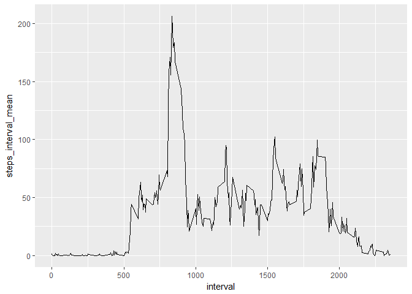

Alfredo Bird-Canals - Course 5 Peer Assessment 1
================

GitHub Documents
----------------

This is an R Markdown format used for publishing markdown documents to GitHub. When you click the **Knit** button all R code chunks are run and a markdown file (.md) suitable for publishing to GitHub is generated.

Initialize Environment
----------------------

``` r
setwd("C:/Users/afbir/Documents/GitHub/RepData_PeerAssessment1")

library(dplyr)
```

    ## 
    ## Attaching package: 'dplyr'

    ## The following objects are masked from 'package:stats':
    ## 
    ##     filter, lag

    ## The following objects are masked from 'package:base':
    ## 
    ##     intersect, setdiff, setequal, union

``` r
library(ggplot2)
library(gridExtra)
```

    ## 
    ## Attaching package: 'gridExtra'

    ## The following object is masked from 'package:dplyr':
    ## 
    ##     combine

Section 1 - Loading and Preprocessing Data
------------------------------------------

### Load data

``` r
dfActivity <- read.csv("activity.csv")

summary(dfActivity)
```

    ##      steps                date          interval     
    ##  Min.   :  0.00   2012-10-01:  288   Min.   :   0.0  
    ##  1st Qu.:  0.00   2012-10-02:  288   1st Qu.: 588.8  
    ##  Median :  0.00   2012-10-03:  288   Median :1177.5  
    ##  Mean   : 37.38   2012-10-04:  288   Mean   :1177.5  
    ##  3rd Qu.: 12.00   2012-10-05:  288   3rd Qu.:1766.2  
    ##  Max.   :806.00   2012-10-06:  288   Max.   :2355.0  
    ##  NA's   :2304     (Other)   :15840

### remove NAs

``` r
dfActivityNoNAs <- dfActivity[complete.cases(dfActivity),]

summary(dfActivityNoNAs)
```

    ##      steps                date          interval     
    ##  Min.   :  0.00   2012-10-02:  288   Min.   :   0.0  
    ##  1st Qu.:  0.00   2012-10-03:  288   1st Qu.: 588.8  
    ##  Median :  0.00   2012-10-04:  288   Median :1177.5  
    ##  Mean   : 37.38   2012-10-05:  288   Mean   :1177.5  
    ##  3rd Qu.: 12.00   2012-10-06:  288   3rd Qu.:1766.2  
    ##  Max.   :806.00   2012-10-07:  288   Max.   :2355.0  
    ##                   (Other)   :13536

### convert date to class Date

``` r
dfActivityNoNAs$date <- as.Date(dfActivityNoNAs$date)

summary(dfActivityNoNAs)
```

    ##      steps             date               interval     
    ##  Min.   :  0.00   Min.   :2012-10-02   Min.   :   0.0  
    ##  1st Qu.:  0.00   1st Qu.:2012-10-16   1st Qu.: 588.8  
    ##  Median :  0.00   Median :2012-10-29   Median :1177.5  
    ##  Mean   : 37.38   Mean   :2012-10-30   Mean   :1177.5  
    ##  3rd Qu.: 12.00   3rd Qu.:2012-11-16   3rd Qu.:1766.2  
    ##  Max.   :806.00   Max.   :2012-11-29   Max.   :2355.0

Section 2 - What is mean total number of steps taken per day?
-------------------------------------------------------------

### Calculate total number of steps taken per day

``` r
dfDailyTotal <- dfActivityNoNAs %>%
  select(date, steps) %>%
  group_by(date) %>%
  summarise(steps_daily_total = sum(steps)) %>%
  na.omit()

summary(dfDailyTotal)
```

    ##       date            steps_daily_total
    ##  Min.   :2012-10-02   Min.   :   41    
    ##  1st Qu.:2012-10-16   1st Qu.: 8841    
    ##  Median :2012-10-29   Median :10765    
    ##  Mean   :2012-10-30   Mean   :10766    
    ##  3rd Qu.:2012-11-16   3rd Qu.:13294    
    ##  Max.   :2012-11-29   Max.   :21194

### Plot total number of steps taken per day

``` r
ggHistogram1 <- ggplot(dfDailyTotal, aes(x=steps_daily_total)) + geom_histogram()

plot(ggHistogram1)
```

    ## `stat_bin()` using `bins = 30`. Pick better value with `binwidth`.


### Calculate and report the mean and median of the total number of steps taken per day

``` r
dfTotalMeanMedian <- dfDailyTotal %>%
  select(steps_daily_total) %>%
  summarise(steps_daily_mean = mean(steps_daily_total), steps_daily_median = median(steps_daily_total))

summary(dfTotalMeanMedian)
```

    ##  steps_daily_mean steps_daily_median
    ##  Min.   :10766    Min.   :10765     
    ##  1st Qu.:10766    1st Qu.:10765     
    ##  Median :10766    Median :10765     
    ##  Mean   :10766    Mean   :10765     
    ##  3rd Qu.:10766    3rd Qu.:10765     
    ##  Max.   :10766    Max.   :10765

``` r
print(paste("Daily Mean = ", format(dfTotalMeanMedian$steps_daily_mean, nsmall=2)))
```

    ## [1] "Daily Mean =  10766.19"

``` r
print(paste("Daily Median = ", dfTotalMeanMedian$steps_daily_median))
```

    ## [1] "Daily Median =  10765"

Section 3 - What is the average daily activity pattern?
-------------------------------------------------------

### Calculate average number of steps taken per interval

``` r
dfIntervalMeanNoNAs <- dfActivityNoNAs %>%
  select(interval, steps) %>%
  group_by(interval) %>%
  summarise(steps_interval_mean = mean(steps)) %>%
  na.omit()

summary(dfIntervalMeanNoNAs)
```

    ##     interval      steps_interval_mean
    ##  Min.   :   0.0   Min.   :  0.000    
    ##  1st Qu.: 588.8   1st Qu.:  2.486    
    ##  Median :1177.5   Median : 34.113    
    ##  Mean   :1177.5   Mean   : 37.383    
    ##  3rd Qu.:1766.2   3rd Qu.: 52.835    
    ##  Max.   :2355.0   Max.   :206.170

### Plot average number of steps taken per interval

``` r
ggTimeSeries1 <- ggplot(dfIntervalMeanNoNAs, aes(x=interval, y=steps_interval_mean)) + geom_line()

plot(ggTimeSeries1)
```



### Calculate and report the mean and median of the total number of steps taken per interval

``` r
dfIntervalMaxMeanNoNAs <- arrange(dfIntervalMeanNoNAs, desc(steps_interval_mean))[1,]

summary(dfIntervalMaxMeanNoNAs)
```

    ##     interval   steps_interval_mean
    ##  Min.   :835   Min.   :206.2      
    ##  1st Qu.:835   1st Qu.:206.2      
    ##  Median :835   Median :206.2      
    ##  Mean   :835   Mean   :206.2      
    ##  3rd Qu.:835   3rd Qu.:206.2      
    ##  Max.   :835   Max.   :206.2

``` r
intIntervalNum <- as.character(dfIntervalMaxMeanNoNAs[1,1])
numIntervalMax <- as.character(round(dfIntervalMaxMeanNoNAs[1,2], digits = 2))

print(paste("Time interval with maximum mean number of steps = ", intIntervalNum))
```

    ## [1] "Time interval with maximum mean number of steps =  835"

``` r
print(paste("Mean number of steps in interval = ", numIntervalMax))
```

    ## [1] "Mean number of steps in interval =  206.17"

Section 4 - Imputing missing values
-----------------------------------

### Calculate and report number of NAs

``` r
intNAs <- nrow(dfActivity) -  nrow(dfActivityNoNAs)

print(paste("Number of NAs = ", as.character(intNAs)))
```

    ## [1] "Number of NAs =  2304"

### Impute interval mean to NAs in new dataset

``` r
dfActivityNew1 <- merge(x=dfActivity, y=dfIntervalMeanNoNAs)

dfActivityNew1$steps[is.na(dfActivityNew1$steps)] <- 
  dfActivityNew1$steps_interval_mean[is.na(dfActivityNew1$steps)]

dfActivityNew2 <- dfActivityNew1 %>% select( interval, steps, date)

summary(dfActivityNew2)
```

    ##     interval          steps                date      
    ##  Min.   :   0.0   Min.   :  0.00   2012-10-01:  288  
    ##  1st Qu.: 588.8   1st Qu.:  0.00   2012-10-02:  288  
    ##  Median :1177.5   Median :  0.00   2012-10-03:  288  
    ##  Mean   :1177.5   Mean   : 37.38   2012-10-04:  288  
    ##  3rd Qu.:1766.2   3rd Qu.: 27.00   2012-10-05:  288  
    ##  Max.   :2355.0   Max.   :806.00   2012-10-06:  288  
    ##                                    (Other)   :15840

### Calculate the total number of steps taken per day (with imputed NAs)

``` r
dfDailyTotal2 <- dfActivityNew2 %>%
  select(date, steps) %>%
  group_by(date) %>%
  summarise(steps_daily_total = sum(steps)) %>%
  na.omit()

summary(dfDailyTotal2)
```

    ##          date    steps_daily_total
    ##  2012-10-01: 1   Min.   :   41    
    ##  2012-10-02: 1   1st Qu.: 9819    
    ##  2012-10-03: 1   Median :10766    
    ##  2012-10-04: 1   Mean   :10766    
    ##  2012-10-05: 1   3rd Qu.:12811    
    ##  2012-10-06: 1   Max.   :21194    
    ##  (Other)   :55

### Plot the total number of steps taken per day (with imputed NAs)

``` r
ggHistogram2 <- ggplot(dfDailyTotal2, aes(x=steps_daily_total)) + geom_histogram()

plot(ggHistogram2)
```

    ## `stat_bin()` using `bins = 30`. Pick better value with `binwidth`.


### Calculate and report the mean and median of the total number of steps taken per day (with imputed NAs)

``` r
dfTotalMeanMedian2 <- dfDailyTotal2 %>%
  select(steps_daily_total) %>%
  summarise(steps_daily_mean = mean(steps_daily_total), steps_daily_median = median(steps_daily_total))

summary(dfTotalMeanMedian2)
```

    ##  steps_daily_mean steps_daily_median
    ##  Min.   :10766    Min.   :10766     
    ##  1st Qu.:10766    1st Qu.:10766     
    ##  Median :10766    Median :10766     
    ##  Mean   :10766    Mean   :10766     
    ##  3rd Qu.:10766    3rd Qu.:10766     
    ##  Max.   :10766    Max.   :10766

``` r
print(paste("Daily Mean with Imputed Values = ", format(dfTotalMeanMedian2$steps_daily_mean, nsmall=2)))
```

    ## [1] "Daily Mean with Imputed Values =  10766.19"

``` r
print(paste("Daily Median with Imputed Values = ", dfTotalMeanMedian2$steps_daily_median))
```

    ## [1] "Daily Median with Imputed Values =  10766.1886792453"

Section 5 - Compare activity by time interval on Weekdays versus Weekends
-------------------------------------------------------------------------

### Create new dataset and add column with weekday or weekend value using weekdays() function

``` r
dfActivityNew3 <- dfActivityNew2

dfActivityNew3$date = as.Date(dfActivityNew3$date)

dfActivityNew3$weekdayorweekend[!weekdays(dfActivityNew3$date) %in% c("Saturday", "Sunday")] <- "weekday"
dfActivityNew3$weekdayorweekend[weekdays(dfActivityNew3$date) %in% c("Saturday", "Sunday")] <- "weekend"

dfActivityNew3WeekDays <- filter(dfActivityNew3, weekdayorweekend == "weekday")

summary(dfActivityNew3WeekDays)
```

    ##     interval          steps             date            weekdayorweekend  
    ##  Min.   :   0.0   Min.   :  0.00   Min.   :2012-10-01   Length:12960      
    ##  1st Qu.: 588.8   1st Qu.:  0.00   1st Qu.:2012-10-16   Class :character  
    ##  Median :1177.5   Median :  0.00   Median :2012-10-31   Mode  :character  
    ##  Mean   :1177.5   Mean   : 35.61   Mean   :2012-10-31                     
    ##  3rd Qu.:1766.2   3rd Qu.: 24.00   3rd Qu.:2012-11-15                     
    ##  Max.   :2355.0   Max.   :806.00   Max.   :2012-11-30

``` r
dfActivityNew3WeekEnds <- filter(dfActivityNew3, weekdayorweekend == "weekend")

summary(dfActivityNew3WeekEnds)
```

    ##     interval          steps             date            weekdayorweekend  
    ##  Min.   :   0.0   Min.   :  0.00   Min.   :2012-10-06   Length:4608       
    ##  1st Qu.: 588.8   1st Qu.:  0.00   1st Qu.:2012-10-18   Class :character  
    ##  Median :1177.5   Median :  0.00   Median :2012-10-31   Mode  :character  
    ##  Mean   :1177.5   Mean   : 42.37   Mean   :2012-10-31                     
    ##  3rd Qu.:1766.2   3rd Qu.: 35.47   3rd Qu.:2012-11-12                     
    ##  Max.   :2355.0   Max.   :785.00   Max.   :2012-11-25

### Calculate mean number per time interval on weekends

``` r
dfIntervalMeanWeekEnd <- dfActivityNew3WeekEnds %>%
  select(interval, steps) %>%
  group_by(interval) %>%
  summarise(steps_interval_mean = mean(steps)) %>%
  na.omit()

summary(dfIntervalMeanWeekEnd)
```

    ##     interval      steps_interval_mean
    ##  Min.   :   0.0   Min.   :  0.000    
    ##  1st Qu.: 588.8   1st Qu.:  1.241    
    ##  Median :1177.5   Median : 32.340    
    ##  Mean   :1177.5   Mean   : 42.366    
    ##  3rd Qu.:1766.2   3rd Qu.: 74.654    
    ##  Max.   :2355.0   Max.   :166.639

### Calculate mean number per time interval on weekdays

``` r
dfIntervalMeanWeekDay <- dfActivityNew3WeekDays %>%
  select(interval, steps) %>%
  group_by(interval) %>%
  summarise(steps_interval_mean = mean(steps)) %>%
  na.omit()

summary(dfIntervalMeanWeekDay)
```

    ##     interval      steps_interval_mean
    ##  Min.   :   0.0   Min.   :  0.000    
    ##  1st Qu.: 588.8   1st Qu.:  2.247    
    ##  Median :1177.5   Median : 25.803    
    ##  Mean   :1177.5   Mean   : 35.611    
    ##  3rd Qu.:1766.2   3rd Qu.: 50.854    
    ##  Max.   :2355.0   Max.   :230.378

### Plot mean number of days per time interval on weekends and weekdays

``` r
ggTimeSeries3 <- ggplot(dfIntervalMeanWeekEnd, aes(x=interval, y=steps_interval_mean)) + 
  geom_line() + 
  ggtitle("weekends") + 
  labs(x = "Interval", y = "Number of Steps") + 
  theme(plot.title = element_text(hjust=0.5))
  
ggTimeSeries4 <- ggplot(dfIntervalMeanWeekDay, aes(x=interval, y=steps_interval_mean)) + 
  geom_line() + 
  ggtitle("weekdays") + 
  labs(x = "Interval", y = "Number of Steps") + 
  theme(plot.title = element_text(hjust=0.5))

grid.arrange(ggTimeSeries3, ggTimeSeries4, nrow=2)
```


End
---
